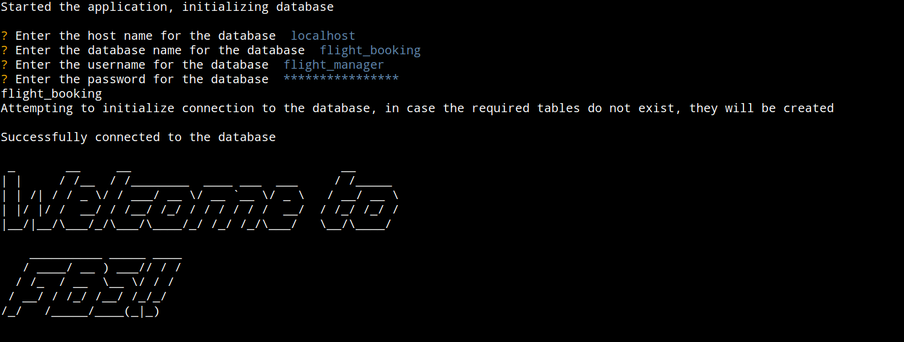
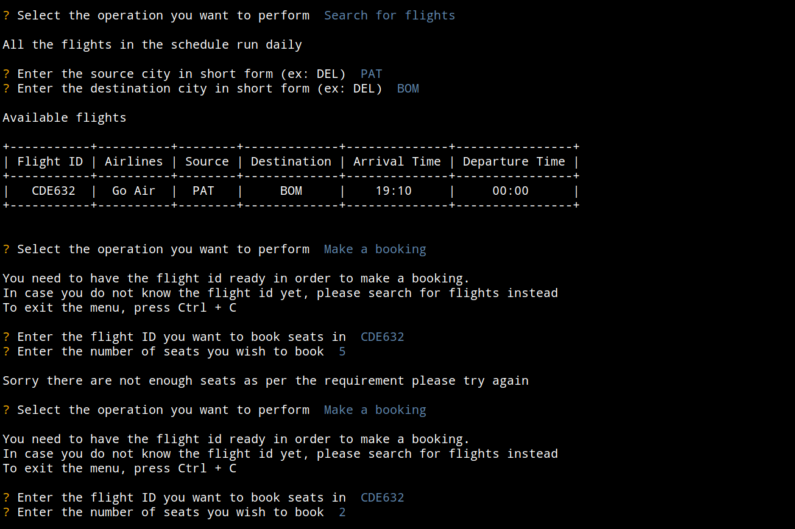
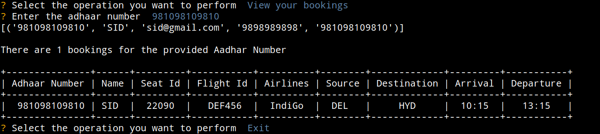

# Introduction

I made this project to apply my knowledge of MYSQL and python and make a pseudo application with it, the current project is a command line application for
simulating Flight Booking System

# How to run
- Clone the repository
- Install requirements by pip install -r requirements.txt
- Create a mysql database and a user with all permissions on that database
- Run the main.py file

# Functionalities
- The project tries to connect to the specified database and creates the requires tables with dummy data in case not already present.
- Search flights
- Book seats in a flight
- View bookings

# Screenshots: 
- Connection and welcome

- Searching for flights and making bookings

- View bookings

